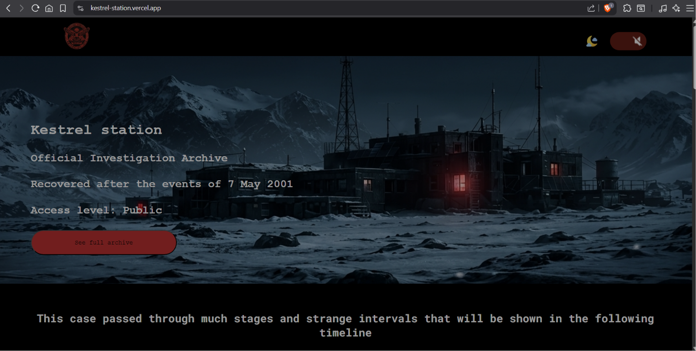
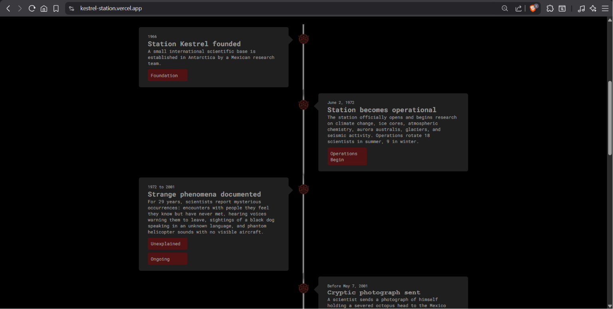
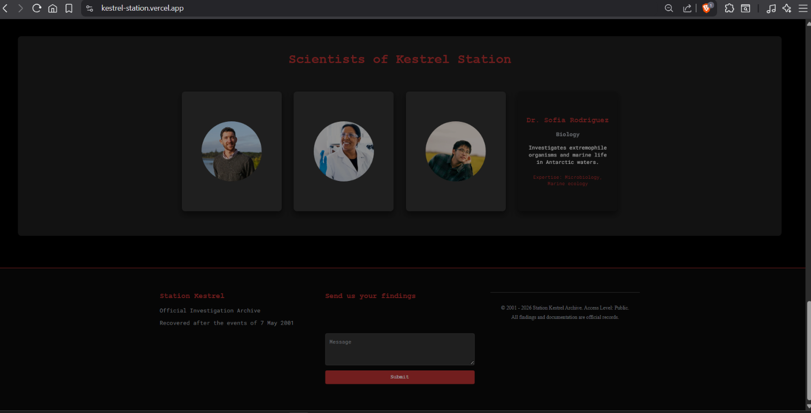
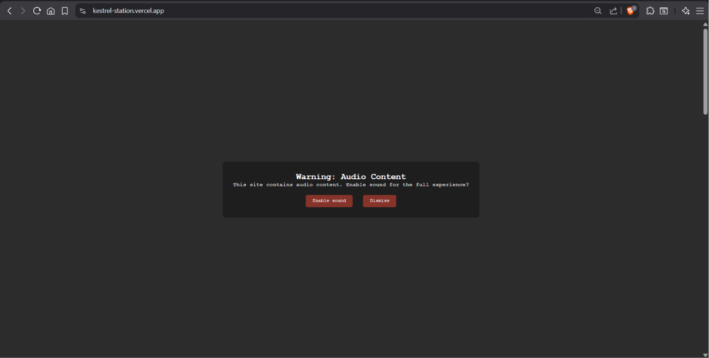

# Kestrel-station
Station Kestrel is a fictional horror website that borrows from psychological horror, presented as an investigative case archive.
### Current features:
* Home page
* On/off sound toggle
* Station responsive timeline
* On/off darkmode toggle
* footer
* footer form(no functionality)
* Scientists info flip cards
* navbar
### Upcoming features:
* Scientist documentations
* Evidence of the events that happenned in the station
### Languages used:
* HTML
* CSS
* Javascript
### Live Demo
[Live Demo](https://kestrel-station.vercel.app/)
### Screenshots:

